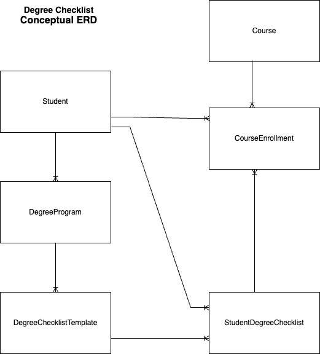
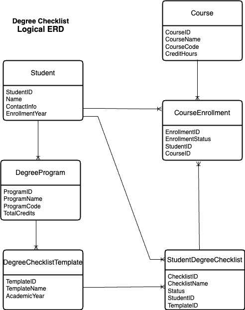
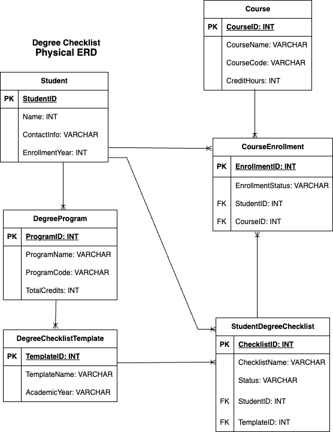

# ERD Diagrams for Degree Checklist

## Conceptual ERD

This ERD shows an overview of the primary entities and their relationships. The entities are: Student, DegreeProgram, Course, DegreeChecklistTemplate, StudentDegreeChecklist, and CourseEnrollment.
The Crow's foot notation indicates the relationships.

## Logical ERD

The logical ERD adds more detail to the conceptual ERD by adding attributes to the existing entities and relationships. This helps us focus on the structure of the data.

## Physical ERD

The physical ERD is the most detailed. It adds database-specific details such as keys, data types, and constraints. It represents the details in tables and columns and still shows relationships present in previous ERDs.

These ERDs provide an understanding of the data structure and relationships within the degree checklist system.